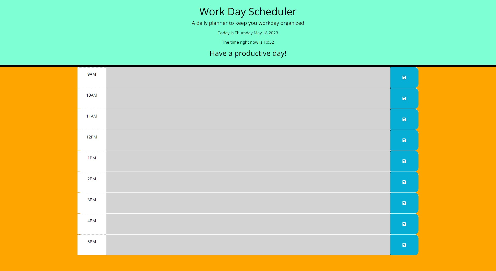

 # 🧪 Workday-Scheduler 🧪
Workday-Scheduler Challenge for UNCC Coding Bootcamp
## ✔️ Task

To create a simple calendar application that allows a user to save events for each hour of the day by modifying starter code. This app will run in the browser and feature dynamically updated HTML and CSS powered by jQuery.

You'll need to use the [Day.js](https://day.js.org/en/) library to work with date and time. Be sure to read the documentation carefully and concentrate on using Day.js in the browser.

## 🔗‍💥 Issues Faced During Project
1.  I went down many different paths to try and figure this challenge out including scrapping most of my code on the final day and starting pretty much from scratch.
2. I am still having issues getting my text area description to show up on the page from the local storage

## 🔎 Preview

## 🔗 Link to Repo
[https://github.com/JHeeebert/code-quiz]

## 🔗 Link to Deployed Site
[https://jheeebert.github.io/code-quiz/]

## 🫶 Contributors
Joshua Hebert
Jhebertcocktails@gmail.com

## ☑️ Version History
**See commit history on GitHub Repo**

## 🙏 Acknowledgments
*Thank you Andrew and Will for teaching us the tools needed to make this happen!*

Made with 🖤 by Joshua Hebert     